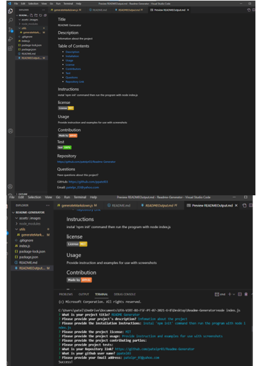

## Project Title
README Generator

## Description 
When creating an open-source project on GitHub, it is important to have a quality README with information about the project.
I created this command-line application with the purpose of dynamically generating a good readme.md file.
I created the application to be invoked with the command node index.js.
Once the command is run the application prompts the user for their GitHub username and questions about their project. The application takes the GitHub username input and makes a call to the GitHub API to retrieve the users email and profile image.

## Table of Contents 
  - [Description](#Description)
  - [Installation](#Installation)
  - [Usage](#Usage)
  - [License](#Licence)
  - [Contributors](#Contributors)
  - [Test](#Test)
  - [Questions](#Questions)
  - [Repository Link](#Repository)
  - [Demo](#Demo)
  - [Github](#Github)
  

 ## Installation

Simply clone the code into your repo and install dependencies with 'npm i' command in terminal, then run the program with the command 'node index.js'.

## Usage 
Provide instructions and examples for use.

## License

## Contributors

## Guidelines

***Create Project:***  With README.md file first

***Installation:***  What are the steps required to install your project? Provide a step-by-step description of how to get the development environment running.

***Usage:***  Provide instructions and examples for use. Include screenshots as needed.

***Licenses:*** This lets other developers know what they can and cannot do with your project. If you need help choosing a license, use https://choosealicense.com/

***Contributing:*** If you created an application or package and would like other developers to contribute to it.

***Tests:*** After done writing code test your application, then provide examples on how to run them.

***Questions:***  Include your GitHub profile and email so users can reach out to you with any questions about your project.

## Test

## Repository

https://github.com/patelpr03/Readme-Generator

## Demo

## Link 
https://watch.screencastify.com/v/Ys3cU0X4yGiBwpbQSb2y

## Questions

Have any questions about this project? Reach out!  
### Github: https://github.com/Patelpr03 
### Email: patelpr_03@yahoo.com