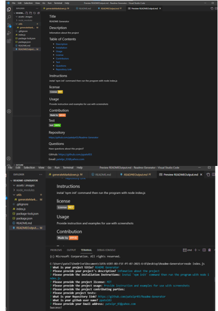

# Your Project Title
    README Generator
## Description 

When creating an open source project on GitHub, it is important to have a quality README with information about the project.
I created this command-line application with the purpose of dynamially generating a good readme.md file.
I created the application to be invoked with the command node index.js.
Once the command is run the application prompts the user for their GitHub username and questions about their project. The application takes the GitHub username input and makes a call to the GitHub API to retrieve the users email and profile image.

## Table of Contents 
    Table of Contents
    Description
    Installation
    Usage
    License
    Contributors
    Test
    Questions
    Repository Link
    Github Info

## Installation

Simply clone the code into your repo and install dependencies with 'npm i' command in terminal, then run the program with the command 'node index.js'.


## Usage 

Provide instructions and examples for use. Include screenshots as needed.

To add a screenshot, create an `assets/images` folder in your repository and upload your screenshot to it. Then, using the relative filepath, add it to your README using the following syntax:

```md

```

## License
[](https://opensource.org/licenses/MIT)

## Questions
If you have any questions, contact Priti Patel on GitHub.
